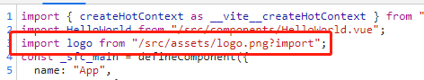
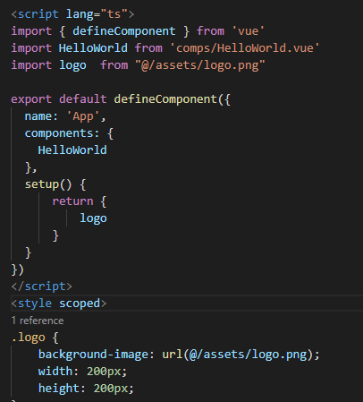
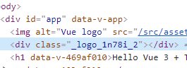
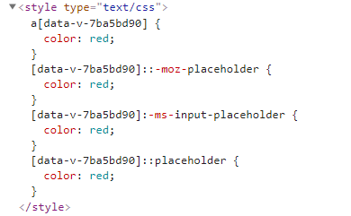

# Vite配置Vue3项目工程实践
### Vite是什么

Vite本身与框架无关，是一套基于插件的项目工程架构，是新的一套对开发者比较友好的一套构建和开发的工具，它的特点就是快，它不会随着项目的规模的变大而让你的开发过程变得卡顿。总的来说就是：Vite是一个开发构建工具，开发过程中它利用浏览器的native ES Module特性按需导入源码，预打包依赖。是为了开发者量身定做的一套开发工具。特点：启动快，更新快。

安装

```javascript
npm init @vitejs/app
```

我选择的vue-ts默认配置

将资源引入为URL

服务时引入一个静态资源会返回解析后的公共路径：

```javascript
import logo  from "./assets/logo.png"
```

使用

```javascript

```

 我们可以看到解析后的图片地址变成了一个绝对地址

 '

css背景里引用图片

```css
.logo {
    background-image: url(./assets/logo.png);
    width: 100px;
    height: 100px;
}
```

设置别名

在vite.config文件里设置

```javascript
export default defineConfig({
  resolve: {
    alias: {
        '@': resolve('./src'),
        'comps': resolve('./src/components')
    }
  },
  plugins: [vue()]
})
```

 

全局样式

可以在main.ts引入

```javascript
import { createApp } from 'vue'
import App from './App.vue'
import './index.css'
createApp(App).mount('#app')
```

使用module模块化方式写css

```css
<style module>
.logo {
    background-image: url(@/assets/logo.png);
    width: 200px;
    height: 200px;
}
</style>
```

这样写了之后就会得到一个$style的变量

```html
<div :class="$style.logo"></div>
```

这样写的好处就是类名会进行hash变成唯一的类名

 

还可以使用约定的方式书写

```javascript
import styles from './App.module.css'
```

```html
<div :class="styles.logo"></div>
```

项目规模变大之后，我们要组织更多样式的时候，我们通常会引入sass或less这样的样式处理器

只需要安装一下sass就可以了，不需要额外配置，比如像webpack那样安装loader

```
npm i -D sass
```

```scss
<style scoped lang="scss">
$link-color: red;
a {
    color: $link-color
}
</style>
```

安装autoprefixer 

```
npm i autoprefixer -D
```

然后在根目录添加一个postcss.config.js的文件

```javascript
module.exports = {
  plugins: [
    require('autoprefixer'),
  ]
}
```

写一个

```
::placeholder{
    color: $link-color
}
```
自动加上了前缀

 

