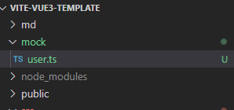
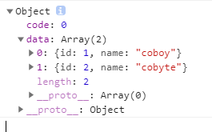

# Vite配置Vue3项目工程实践
### Vite是什么

Vite本身与框架无关，是一套基于插件的项目工程架构，是新的一套对开发者比较友好的一套构建和开发的工具，它的特点就是快，它不会随着项目的规模的变大而让你的开发过程变得卡顿。总的来说就是：Vite是一个开发构建工具，开发过程中它利用浏览器的native ES Module特性按需导入源码，预打包依赖。是为了开发者量身定做的一套开发工具。特点：启动快，更新快。

安装

```javascript
npm init @vitejs/app
```

我选择的vue-ts默认配置

将资源引入为URL

服务时引入一个静态资源会返回解析后的公共路径：

```javascript
import logo  from "./assets/logo.png"
```

使用

```javascript

```

 我们可以看到解析后的图片地址变成了一个绝对地址

 '

css背景里引用图片

```css
.logo {
    background-image: url(./assets/logo.png);
    width: 100px;
    height: 100px;
}
```

设置别名

在vite.config文件里设置

```javascript
export default defineConfig({
  resolve: {
    alias: {
        '@': resolve('./src'),
        'comps': resolve('./src/components')
    }
  },
  plugins: [vue()]
})
```

 

全局样式

可以在main.ts引入

```javascript
import { createApp } from 'vue'
import App from './App.vue'
import './index.css'
createApp(App).mount('#app')
```

使用module模块化方式写css

```css
<style module>
.logo {
    background-image: url(@/assets/logo.png);
    width: 200px;
    height: 200px;
}
</style>
```

这样写了之后就会得到一个$style的变量

```html
<div :class="$style.logo"></div>
```

这样写的好处就是类名会进行hash变成唯一的类名

 

还可以使用约定的方式书写

```javascript
import styles from './App.module.css'
```

```html
<div :class="styles.logo"></div>
```

项目规模变大之后，我们要组织更多样式的时候，我们通常会引入sass或less这样的样式处理器

只需要安装一下sass就可以了，不需要额外配置，比如像webpack那样安装loader

```
npm i -D sass
```

```scss
<style scoped lang="scss">
$link-color: red;
a {
    color: $link-color
}
</style>
```

安装autoprefixer 

```
npm i autoprefixer -D
```

然后在根目录添加一个postcss.config.js的文件

```javascript
module.exports = {
  plugins: [
    require('autoprefixer'),
  ]
}
```

写一个

```
::placeholder{
    color: $link-color
}
```
自动加上了前缀

 

ts

Vite原生就整合了ts，你并不需要进行太多的额外配置就可以使用了，可以在package.json里配置限制TypeScript的版本

```javascript
"devDependencies": {
    "typescript": "^4.3.2",
}
```

配置代理服务器

在根目录vite.config文件进行如下配置就可以了

```javascript
export default defineConfig({
  server: {
    proxy: {
      '/api': {
        target: 'http://www.baidu.com',
        changeOrigin: true,
        rewrite: (path) => path.replace(/^\/api/, ''),
      },
    },
  },
})
```

数据mock

安装依赖

```
npm i mockjs -S // 运行时依赖所以-S
npm i vite-plugin-mock -D
```

在根目录的vite.config文件还需要进行如下的配置

```javascript
import {viteMockServe} from 'vite-plugin-mock'
export default defineConfig({
	plugins: [viteMockServe({})],
})
```

在根目录下新建一个mock文件

 

写上一个模拟接口

```javascript
export default [
  {
    url: "/api-dev/user/list",
    method: "get",
    response: req => {
      return {
        code: 0,
        data: [{ id: 1, name: "coboy" }, { id: 2, name: "cobyte" }],
      };
    },
  }
];
```

再写上一个请求

```javascript
fetch("/api-dev/user/list").then(res => res.json()).then(r=> console.log(r))
```

书写配置正确就可以在控制台看到打印的数据了。

 

代码规范

使用eslint + prettier 规范项目代码，eslint做规范化的检测，prettier做格式化的操作

安装依赖

```javascript
{
  "@typescript-eslint/eslint-plugin": "^4.15.2",
  "@typescript-eslint/parser": "^4.15.2",
  "@vue/eslint-config-prettier": "^6.0.0",
  "@vue/eslint-config-typescript": "^7.0.0",
  "@vuedx/typescript-plugin-vue": "^0.6.3",
  "eslint": "^7.20.0",
  "eslint-plugin-prettier": "^3.3.1",
  "eslint-plugin-vue": "^7.6.0",
  "prettier": "^2.2.1",
}
```

eslint通过eslint-plugin-vue插件对.vue文件进行校验

配置.eslintrc.js文件

```javascript
module.exports = {
  root: true,
  env: {
    browser: true,
    es2021: true,
    node: true
  },
  extends: [
    'plugin:vue/vue3-recommended',
    'eslint:recommended',
    '@vue/typescript/recommended',
    '@vue/prettier',
    '@vue/prettier/@typescript-eslint'
  ],
  parserOptions: {
    ecmaVersion: 2021
  },
  plugins: [],
  rules: {
    'no-unused-vars': 'off',
    '@typescript-eslint/no-unused-vars': 'off'
  }
}
```

配置package包检测命令

```
"lint": "eslint --ext .ts,tsx,vue src/** --no-error-on-unmatched-pattern --quiet",
"lint:fix": "eslint --ext .ts,tsx,vue src/** --no-error-on-unmatched-pattern --fix"
```

--quiet 不显示警告

--fix 自动修复

配置忽略检查的文件.eslintignore

```
*.css
*.less
*.scss
*.jpg
*.png
*.gif
*.svg
*vue.d.ts
```

测试配置

使用jest和@vue/test-utils测试组件

安装依赖

```
"jest": "^26.6.3",
"@types/jest": "^26.0.20",
"vue-jest": "^5.0.0-alpha.7",
"babel-jest": "^26.6.3",
"@babel/preset-env": "^7.12.17",
"@vue/test-utils": "^2.0.0-beta.9",
"ts-jest": "^26.5.1",
"@babel/preset-typescript": "^7.12.17",
```

配置jest.config.js文件

```javascript
module.exports = {
  transform: {
    //  用 `vue-jest` 处理 `*.vue` 文件
    '^.+\\.vue$': 'vue-jest',
    '^.+\\.jsx?$': 'babel-jest', // Adding this line solved the issue
    '^.+\\.tsx?$': 'ts-jest',
  },
  // support alias
  moduleNameMapper: {
    '^@/components(.*)$': '<rootDir>/src/components$1',
  },
  testMatch: ['**/tests/unit/**/*.[jt]s?(x)'],
}
```

在tsconfig.json文件里配置jest

```javascript
"compilerOptions": {
	"types": ["vite/client", "jest"],
}
```

在package.json里配置运行命令

```javascript
"test:unit": "jest"
```

ts有可能存在一些比较前卫的语法，所以需要配置一下babel

配置babel.config.js

```javascript
module.exports = {
    presets: [
      ["@babel/preset-env", { targets: { node: "current" } }],
      "@babel/preset-typescript",
    ],
};
```

提交的时候跑lint同时跑测试

安装依赖

```
"lint-staged": "^10.5.4",
"yorkie": "^2.0.0"
```

```javascript
"gitHooks": {
    "pre-commit": "lint-staged",
    "pre-push": "npm run test:unit"
},
"lint-staged": {
    "*.{js,vue}": "eslint --fix"
},
```

`Error Unexpected trailing comma. comma-dangle`错误Eslint代码检测report数据 

vs code的“文件-首选项-设置”，搜索“comma”，把：

> Prettier: Trailing Comma

设置为“none”。 